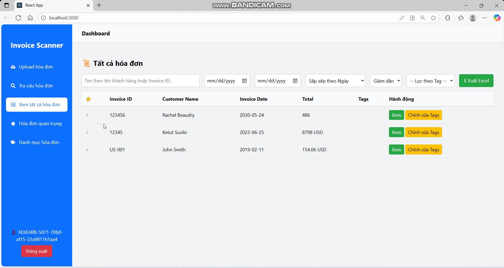
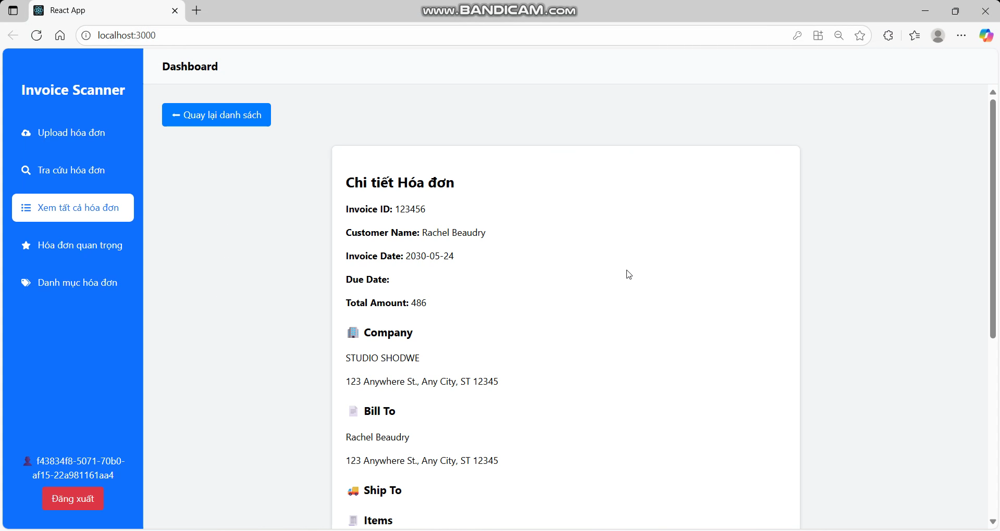
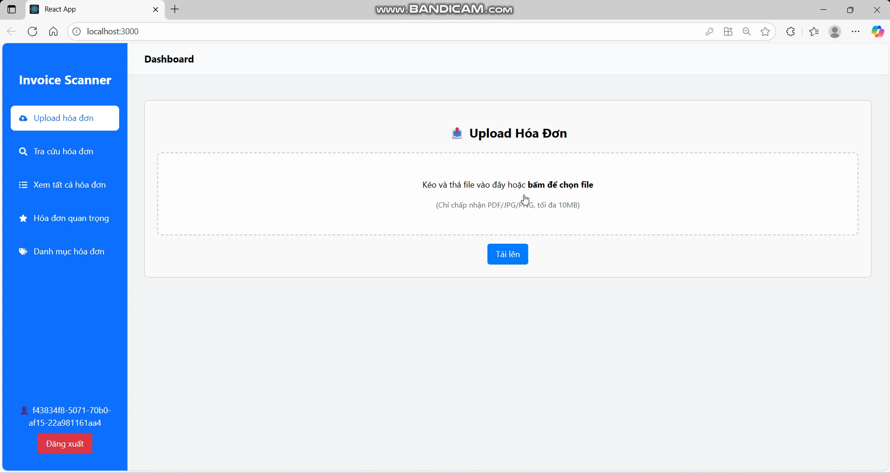
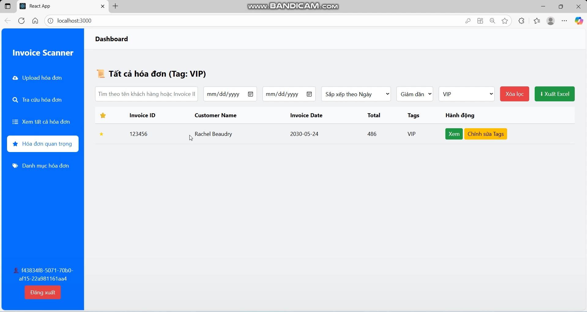
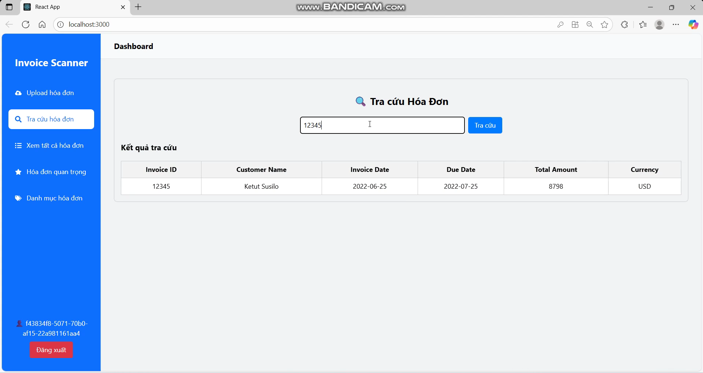
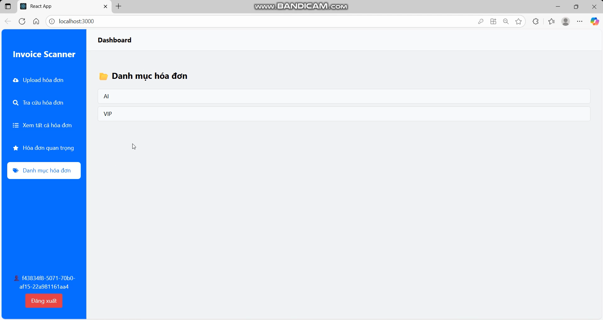

# AI Invoice Scanner

AI Invoice Scanner là một ứng dụng serverless trên AWS giúp tự động quét và trích xuất thông tin từ hóa đơn bằng AI (AWS Textract + Bedrock), lưu trữ dữ liệu hóa đơn trên DynamoDB, và cung cấp API để quản lý hóa đơn.

## Features

- Tự động nhận dạng và trích xuất dữ liệu từ file hóa đơn tải lên.
- Sử dụng AWS Textract và Amazon Bedrock để xử lý dữ liệu AI.
- Lưu trữ và quản lý thông tin hóa đơn trên DynamoDB.
- API RESTful để truy xuất, cập nhật hóa đơn.
- Giao diện frontend đơn giản với AWS Amplify.

## Architecture Overview

- **S3**: Lưu trữ file hóa đơn.
- **Lambda**: Xử lý sự kiện, gọi Textract và Bedrock, cập nhật DynamoDB.
- **DynamoDB**: Lưu trữ dữ liệu hóa đơn.
- **API Gateway**: Cung cấp API cho frontend và client.
- **AWS Textract**: Trích xuất dữ liệu từ ảnh hóa đơn.
- **Amazon Bedrock**: Xử lý và chuẩn hóa dữ liệu hóa đơn.
- **AWS Amplify**: Triển khai frontend React.
- **AWS Cognito**: Quản lý xác thực người dùng.

## Prerequisites

- AWS Account với quyền truy cập IAM phù hợp.
- AWS CLI đã cấu hình.
- Node.js (phiên bản phù hợp).
- Git để clone source code.

## Installation

1. **Thực hiện tuần tự các bước theo hướng dẫn trong workshop tại:**

   [https://kienhao2209.github.io](https://kienhao2209.github.io)

   Đây là bước quan trọng để:
   - Khởi tạo và cấu hình các dịch vụ AWS (S3, Lambda, API Gateway, DynamoDB, Cognito).
   - Tạo hàm Lambda Functions cần thiết.
   - Cấu hình AWS Amplify và Authentication.

2. **Clone repository về máy:**
   
```bash
git clone git@github.com:kienhao2209/ai-invoice-scanner.git
```
3. **Cài đặt dependencies frontend**: Bạn hãy làm theo Workshop tại phần **Triển khai Frontend** nhé.
**Note: this is a one-way operation. Once you `eject`, you can't go back!**

## Usage

-  Upload hóa đơn dưới dạng file ảnh hoặc PDF.
-  Hệ thống tự động trích xuất và lưu dữ liệu.
-  Quản lý, tìm kiếm, đánh dấu hóa đơn thông qua giao diện và API.

## Tech Stack

-  AWS Lambda
-  AWS Textract
-  Amazon Bedrock
-  DynamoDB
-  API Gateway
-  AWS Amplify (React)
-  AWS Cognito
-  Node.js

## Contributing

Mọi đóng góp vui lòng tạo Pull Request hoặc Issue để trao đổi.

## Demo interface

### Danh sách hóa đơn



### Trang chi tiết hóa đơn



### Upload hóa đơn mới



### Trang hóa đơn quan trọng



### Trang tra cứu hóa đơn theo ID hoặc tên khách hàng



### Trang danh mục hóa đơn (tags)



## Function

AI Invoice Scanner hỗ trợ đầy đủ các chức năng quản lý hóa đơn thông minh:

1. **Upload file (image/PDF)** – Tải lên hóa đơn dưới dạng ảnh hoặc PDF để hệ thống tự động xử lý.
2. **Details invoices** – Xem chi tiết thông tin hóa đơn đã được AI trích xuất.
3. **List invoices** – Hiển thị danh sách toàn bộ hóa đơn đã lưu.
4. **Lookup invoice** – Tìm kiếm hóa đơn theo từ khóa hoặc ID.
5. **Export file Excel** – Xuất dữ liệu hóa đơn ra file Excel để lưu trữ hoặc phân tích.
6. **Lọc theo khoảng thời gian** – Lọc hóa đơn theo ngày phát hành hoặc khoảng thời gian mong muốn.
7. **Sắp xếp theo số tiền** – Sắp xếp danh sách hóa đơn tăng/giảm theo giá trị.
8. **Sắp xếp theo ngày hóa đơn** – Sắp xếp hóa đơn theo ngày phát hành.
9. **Kéo-thả khi upload file** – Hỗ trợ drag-and-drop để tải lên hóa đơn nhanh chóng.
10. **Category invoice** – Phân loại hóa đơn theo danh mục.
11. **Update tags** – Thêm hoặc chỉnh sửa thẻ (tags) cho hóa đơn.
12. **Filter tags** – Lọc hóa đơn theo thẻ (tags).
13. **Starred invoices** – Đánh dấu các hóa đơn quan trọng để theo dõi nhanh.
